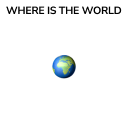

<div id="top"></div>

[![Contributors][contributors-shield]][contributors-url]
[![Forks][forks-shield]][forks-url]
[![Stargazers][stars-shield]][stars-url]
[![Issues][issues-shield]][issues-url]
[![MIT License][license-shield]][license-url]

<!-- PROJECT LOGO -->
<br />
<div align="center">
  <a href="https://alexkasatov.github.io/wtw-app/#/">
    
  </a>

<h3 align="center">Where Is The World</h3>

  <p align="center">
    project_description
    <br />
    <a href="https://github.com/AlexKasatov/wtw-app"><strong>Explore the docs »</strong></a>
    <br />
    <br />
    <a href="https://github.com/AlexKasatov/wtw-app">View Demo</a>
    ·
    <a href="https://github.com/AlexKasatov/wtw-app/issues">Report Bug</a>
    ·
    <a href="https://github.com/AlexKasatov/wtw-app/issues">Request Feature</a>
  </p>
</div>

<!-- TABLE OF CONTENTS -->
<details>
  <summary>Table of Contents</summary>
  <ol>
    <li>
      <a href="#about-the-project">About The Project</a>
      <ul>
        <li><a href="#built-with">Built With</a></li>
      </ul>
    </li>
    <li>
      <a href="#getting-started">Getting Started</a>
      <ul>
        <li><a href="#prerequisites">Prerequisites</a></li>
        <li><a href="#installation">Installation</a></li>
      </ul>
    </li>
    <li><a href="#contributing">Contributing</a></li>
    <li><a href="#license">License</a></li>
    <li><a href="#contact">Contact</a></li>

  </ol>
</details>

<!-- ABOUT THE PROJECT -->

## About The Project

<!-- ! past project url here -->

[![Product Name Screen Shot][product-screenshot]](https://alexkasatov.github.io/wtw-app/#/)

Hi there! Here's my solution from [frontendementor.io](https://www.frontendmentor.io/challenges/rest-countries-api-with-color-theme-switcher-5cacc469fec04111f7b848ca)
I've added some custom features like map & stylies.

<p align="right">(<a href="#top">back to top</a>)</p>

### Built With

- [React.js](https://reactjs.org/)
- [CRA](https://create-react-app.dev/)
- [React Router](https://reactrouter.com/docs/en/v6/getting-started/overview)
- [Styled Components](https://styled-components.com/)
- [Axios](https://axios-http.com/docs/intro)
- [Mapbox](https://docs.mapbox.com/help/tutorials/use-mapbox-gl-js-with-react/)
- [React-select](https://react-select.com/home)
- [React-icons](https://react-icons.github.io/react-icons/)

<p align="right">(<a href="#top">back to top</a>)</p>

<!-- GETTING STARTED -->

## Getting Started

This is an example of how you may give instructions on setting up your project locally.
To get a local copy up and running follow these simple example steps.

### Prerequisites

This is an example of how to list things you need to use the software and how to install them.

- npm

  ```sh
  npm install npm@latest -g
  ```

### Installation

1. Get a free API Key at [Mapbox](https://www.mapbox.com/)
2. Clone the repo

   ```sh
   git clone https://github.com/AlexKasatov/wtw-app.git
   ```

3. Install NPM packages

   ```sh
   npm install
   ```

4. Enter your API in `.env` file

   ```env
   REACT_APP_API_KEY = "ENTER YOUR API";
   ```

<p align="right">(<a href="#top">back to top</a>)</p>

<!-- CONTRIBUTING -->

## Contributing

Contributions are what make the open source community such an amazing place to learn, inspire, and create. Any contributions you make are **greatly appreciated**.

If you have a suggestion that would make this better, please fork the repo and create a pull request. You can also simply open an issue with the tag "enhancement".
Don't forget to give the project a star! Thanks again!

1. Fork the Project
2. Create your Feature Branch (`git checkout -b feature/AmazingFeature`)
3. Commit your Changes (`git commit -m 'Add some AmazingFeature'`)
4. Push to the Branch (`git push origin feature/AmazingFeature`)
5. Open a Pull Request

<p align="right">(<a href="#top">back to top</a>)</p>

<!-- LICENSE -->

## License

Distributed under the MIT License. See `LICENSE.txt` for more information.

<p align="right">(<a href="#top">back to top</a>)</p>

<!-- CONTACT -->

## Contact

Alex Kasatov - alexmorton_dev@protonmail.com - alexkasatovdesign@gmail.com

Project Link: [https://github.com/AlexKasatov/wtw-app](https://github.com/AlexKasatov/wtw-app)

<p align="right">(<a href="#top">back to top</a>)</p>

<!-- MARKDOWN LINKS & IMAGES -->
<!-- https://www.markdownguide.org/basic-syntax/#reference-style-links -->

[contributors-shield]: https://img.shields.io/github/contributors/github_username/repo_name.svg?style=for-the-badge
[contributors-url]: https://github.com/AlexKasatov/wtw-app/graphs/contributors
[forks-shield]: https://img.shields.io/github/forks/AlexKasatov/wtw-app.svg?style=for-the-badge
[forks-url]: https://github.com/AlexKasatov/wtw-app/network/members
[stars-shield]: https://img.shields.io/github/stars/AlexKasatov/wtw-app.svg?style=for-the-badge
[stars-url]: https://github.com/AlexKasatov/wtw-app/stargazers
[issues-shield]: https://img.shields.io/github/issues/AlexKasatov/wtw-app.svg?style=for-the-badge
[issues-url]: https://github.com/AlexKasatov/wtw-app/issues
[license-shield]: https://img.shields.io/github/license/AlexKasatov/wtw-app.svg?style=for-the-badge
[license-url]: https://github.com/AlexKasatov/wtw-app/blob/master/LICENSE.txt
[product-screenshot]: public/img/project-mockup.png
